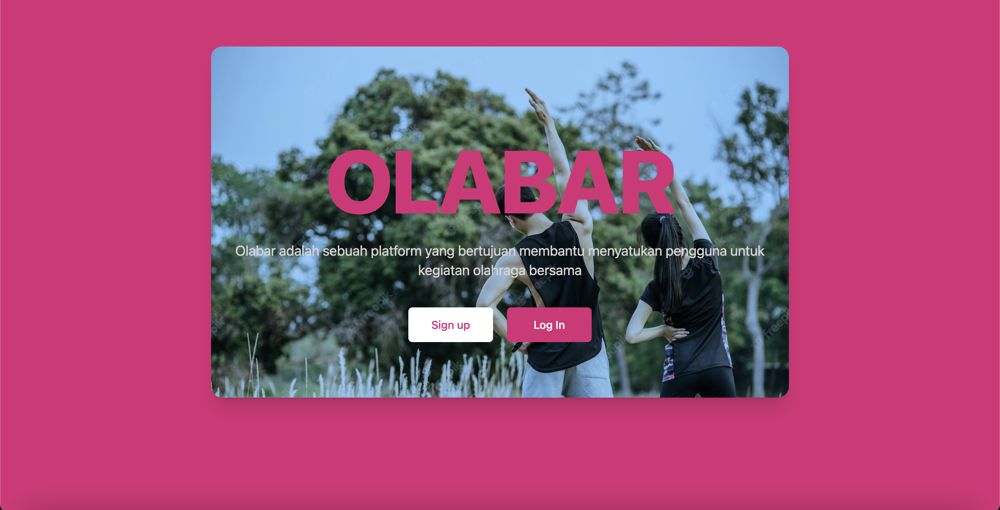
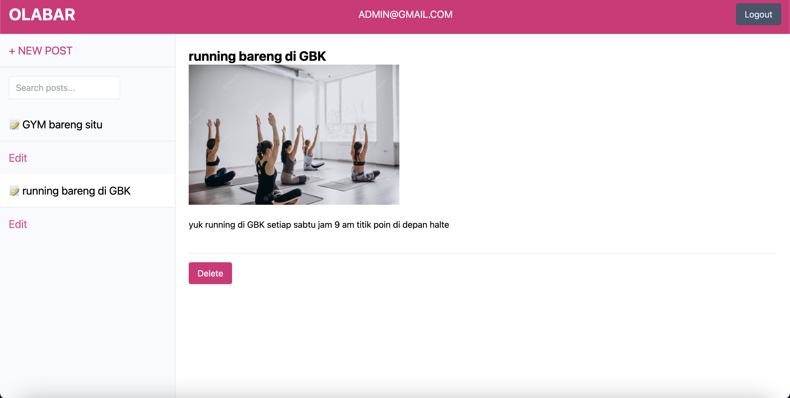
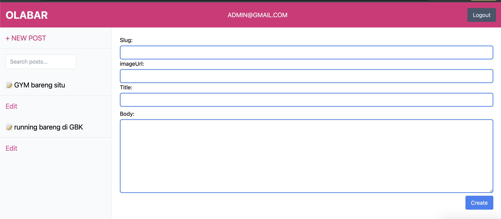
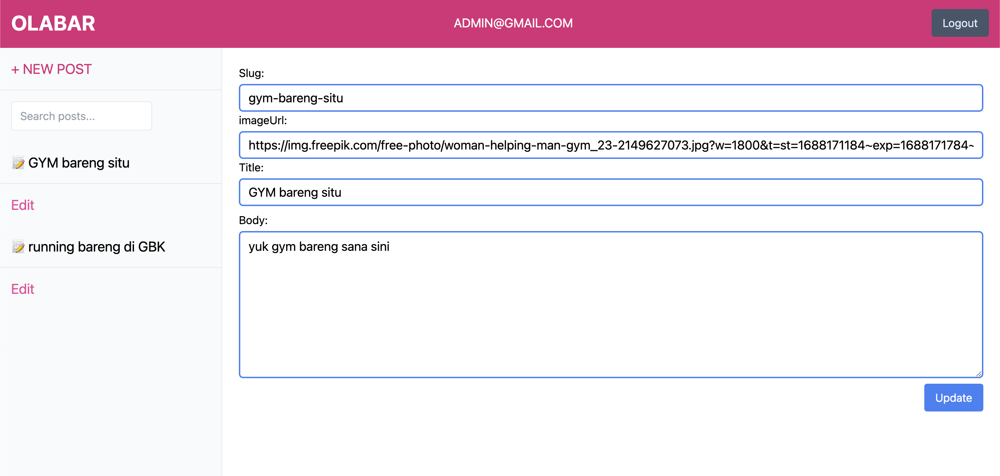

# Week 20 Assignment (react router with Server-side rendering (SSR) )

For this week's assignment, I'm building a front-end website SSR using React.

## Links

[olabar.meselghea.site](https://olabar.meselghea.site/)

## Quick Start

1. Open [olabar.meselghea.site](https://olabar.meselghea.site/)

2. Login with admin account
   `email: "admin@gmail.com"
password: "admin123"`

3. Now you can explore the dashboard!

##

